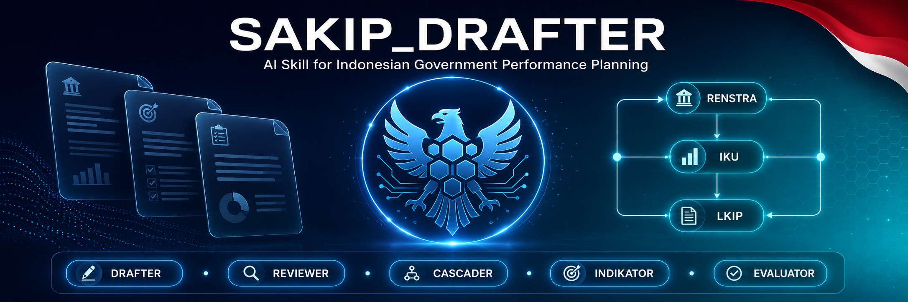

<p align="center">
  
</p>

<div align="center">

# 🏛️ SAKIP_DRAFTER

<p align="center">
  <strong>AI Skill untuk Perencana SAKIP Pemerintah Daerah Indonesia</strong><br/>
  Didukung oleh Claude · Dikembangkan oleh NST/NUSTEK · Kalimantan Tengah
</p>

<p align="center">
  
  
  
  
</p>

<p align="center">
  
  
  
  
</p>

<p align="center">
  
  
  
  
</p>

</div>

---

## 📖 Tentang Skill Ini

**SAKIP_DRAFTER** adalah skill Claude yang membekali AI dengan pengetahuan mendalam tentang sistem **Akuntabilitas Kinerja Instansi Pemerintah (SAKIP)** untuk lingkungan Pemerintah Daerah Indonesia. Skill ini menguasai regulasi kunci (Perpres 29/2014, Permendagri 86/2017, PermenPAN-RB 88/2021, dsb) dan template dokumen SAKIP resmi.

Cukup bicara natural dalam chat — skill mendeteksi kebutuhan dan mengaktifkan mode yang tepat secara otomatis.

---

## ✨ Fitur Utama

| Mode | Pemicu | Fungsi |
|---|---|---|
| 🔵 **DRAFTER** | *"buatkan", "susunkan", "tuliskan"* | Menyusun draf dokumen SAKIP dari nol |
| 🟠 **REVIEWER** | *"review", "nilai", "cek", "koreksi"* | Menganalisis & merekomendasikan perbaikan dokumen |
| 🟢 **CASCADER** | *"turunkan", "cascading", "breakdown"* | Menurunkan kinerja antar level eselon secara logis |
| 🟡 **INDIKATOR** | *"IKU", "IKK", "indikator", "ukuran kinerja"* | Merancang IKU/IKK yang memenuhi kriteria SMART-C |
| 🔴 **EVALUATOR** | *"nilai AKIP", "skor AKIP", "simulasi evaluasi"* | Mensimulasikan penilaian AKIP 5 komponen |

### Dokumen yang Didukung

```
RPJMD          Renstra OPD      Renja OPD        Perjanjian Kinerja (PK)
IKU / IKK      LKIP / LAKIP     Pohon Kinerja    Matriks Cascading
RKT            SKP ASN
```

### Format Output

- 📄 **Narasi Birokrasi** — Bahasa Indonesia formal sesuai PUEBI & standar Permendagri
- 📊 **Tabel Terstruktur** — Markdown siap pakai
- 🔌 **JSON** — 5 skema standar untuk integrasi sistem (DeDi, SIM, API)

---

## 🚀 Cara Install & Penggunaan

> Pilih jalur sesuai platform yang Anda gunakan:

### ☁️ Jalur 1 — Claude.ai (Browser / Mobile)
> **Untuk: Staf OPD, perencana, analis kebijakan — tanpa instalasi teknis**

Cara paling mudah: gunakan fitur **Projects** di [claude.ai](https://claude.ai).

**Langkah-langkah:**

```
1. Buka claude.ai → Login ke akun Anda
2. Klik "Projects" di sidebar → "+ New Project"
3. Beri nama project, contoh: "SAKIP Assistant Pemda"
4. Buka tab "Project Instructions"
5. Copy seluruh isi file SKILL.md dari paket ini
6. Paste ke kolom Project Instructions → klik Save
7. Mulai chat baru di dalam project tersebut ✅
```

> 💡 **Tips Tim:** Undang rekan kerja ke project yang sama — mereka langsung bisa
> menggunakan SAKIP_DRAFTER tanpa perlu setup ulang.

**Alternatif cepat (tanpa Project):**

Paste isi `SKILL.md` sebagai pesan pertama di chat baru mana pun:

```
Gunakan panduan berikut untuk setiap responsmu:
[paste seluruh isi SKILL.md di sini]
```

---

### 💻 Jalur 2 — Claude Code CLI (Terminal / VSCode / JetBrains)
> **Untuk: Developer, technical user — instalasi permanen di komputer lokal**

**Prasyarat:**

```bash
# Pastikan Claude Code sudah terinstall
npm install -g @anthropic-ai/claude-code

# Verifikasi instalasi
claude --version
```

**Instalasi skill:**

```bash
# macOS / Linux
# ─────────────────────────────────────────────
# 1. Buat folder skills (jika belum ada)
mkdir -p ~/.claude/skills

# 2. Pindahkan file .skill ke folder tersebut
cp sakip-drafter.skill ~/.claude/skills/

# 3. Ekstrak file .skill (formatnya ZIP)
cd ~/.claude/skills/
unzip sakip-drafter.skill -d sakip-drafter/

# 4. Verifikasi hasil ekstrak
ls ~/.claude/skills/sakip-drafter/
# Output: SKILL.md  README.md  references/
```

```powershell
# Windows (PowerShell)
# ─────────────────────────────────────────────
# 1. Buat folder skills
New-Item -ItemType Directory -Force "$env:USERPROFILE\.claude\skills"

# 2. Pindahkan file .skill
Copy-Item sakip-drafter.skill "$env:USERPROFILE\.claude\skills\"

# 3. Ekstrak file .skill
cd "$env:USERPROFILE\.claude\skills"
Expand-Archive sakip-drafter.skill -DestinationPath sakip-drafter

# 4. Verifikasi
dir "$env:USERPROFILE\.claude\skills\sakip-drafter"
```

**Lokasi folder skills per OS:**

| Sistem Operasi | Path Folder Skills |
|---|---|
| macOS / Linux | `~/.claude/skills/sakip-drafter/` |
| Windows | `C:\Users\[nama_user]\.claude\skills\sakip-drafter\` |

Setelah instalasi, Claude Code otomatis mendeteksi skill setiap kali kata kunci
SAKIP muncul dalam percakapan.

---

### 🔌 Jalur 3 — Integrasi API (Aplikasi Web / Backend)
> **Untuk: Developer yang membangun aplikasi eGovernment (DeDi, SIM, portal Pemda)**

Gunakan isi `SKILL.md` sebagai `system` parameter pada setiap API call ke Anthropic.

**PHP (Laravel / Native):**

```php
<?php
// Load SKILL.md sebagai system prompt
$systemPrompt = file_get_contents(__DIR__ . '/sakip-drafter/SKILL.md');

$client = new \GuzzleHttp\Client();
$response = $client->post('https://api.anthropic.com/v1/messages', [
    'headers' => [
        'x-api-key'         => env('ANTHROPIC_API_KEY'),
        'anthropic-version' => '2023-06-01',
        'Content-Type'      => 'application/json',
    ],
    'json' => [
        'model'      => 'claude-sonnet-4-20250514',
        'max_tokens' => 4096,
        'system'     => $systemPrompt,
        'messages'   => [
            ['role' => 'user', 'content' => $userInput]
        ],
    ],
]);

$data = json_decode($response->getBody(), true);
echo $data['content'][0]['text'];
```

**JavaScript / Node.js:**

```javascript
import Anthropic from '@anthropic-ai/sdk';
import { readFileSync } from 'fs';

const client    = new Anthropic({ apiKey: process.env.ANTHROPIC_API_KEY });
const sysPrompt = readFileSync('./sakip-drafter/SKILL.md', 'utf-8');

const response = await client.messages.create({
  model     : 'claude-sonnet-4-20250514',
  max_tokens: 4096,
  system    : sysPrompt,
  messages  : [{ role: 'user', content: userInput }],
});

console.log(response.content[0].text);
```

**Python:**

```python
import anthropic

with open('./sakip-drafter/SKILL.md', 'r', encoding='utf-8') as f:
    system_prompt = f.read()

client  = anthropic.Anthropic(api_key="ANTHROPIC_API_KEY")
message = client.messages.create(
    model     = "claude-sonnet-4-20250514",
    max_tokens= 4096,
    system    = system_prompt,
    messages  = [{"role": "user", "content": user_input}]
)
print(message.content[0].text)
```

> 💡 Untuk output JSON (integrasi database), tambahkan instruksi di system prompt:
> `"Jika diminta data terstruktur, gunakan format JSON sesuai skema di references/json-schema.md"`

---

## 📦 Berbagi ke Laptop / Akun Lain

File `sakip-drafter.skill` (±23KB) adalah satu file mandiri yang bisa
kirim via media apapun:

```
📦 sakip-drafter.skill
│
├── 📧  Email attachment
├── 💬  WhatsApp / Telegram
├── ☁️  Google Drive / OneDrive / Dropbox
├── 🔗  GitHub Release / GitLab
└── 💾  USB / Flashdisk
```

Penerima cukup ikuti salah satu jalur instalasi di atas sesuai platform mereka.

---

## 🗺️ Ringkasan Jalur Instalasi

| Profil Pengguna | Jalur Terbaik | Waktu Setup |
|---|---|---|
| Staf OPD / ASN perencana | ☁️ Jalur 1 — Claude.ai Project | < 5 menit |
| Developer / technical user | 💻 Jalur 2 — Claude Code CLI | < 10 menit |
| Aplikasi eGovernment (DeDi/SIM) | 🔌 Jalur 3 — API Integration | Sesuai stack |
| Berbagi ke seluruh tim | Kirim `.skill` + README ini | Instant |

---

## 💬 Contoh Prompt

```bash
# ── MODE DRAFTER ────────────────────────────────────────────────────────
"Buatkan draf Renstra Dinas Kesehatan Kabupaten Barito Utara 2025–2029.
 Visi Bupati: 'Barito Utara Maju dan Sejahtera'. Sasaran RPJMD terkait:
 menurunkan stunting ke 14% dan meningkatkan AHH ke 70,5 tahun."

# ── MODE REVIEWER ───────────────────────────────────────────────────────
"Review IKU Dinas Perhubungan ini, apakah sudah sesuai standar SAKIP?
 1. Jumlah rapat koordinasi = 12 kali
 2. Terlaksananya pengadaan rambu lalu lintas"

# ── MODE CASCADER ───────────────────────────────────────────────────────
"Turunkan IKU Kepala Dinas Sosial berikut ke 3 Kabid di bawahnya.
 IKU: Persentase PMKS yang Mendapat Penanganan = 70%"

# ── MODE INDIKATOR ──────────────────────────────────────────────────────
"Rancangkan IKU yang SMART untuk Dinas Lingkungan Hidup Kabupaten kami."

# ── MODE EVALUATOR ──────────────────────────────────────────────────────
"Simulasikan nilai AKIP Dinas Pertanian kami: Renstra ada tapi target
 tidak progresif, PK lengkap tanpa cascading Eselon IV, LKIP tepat waktu
 tapi analisis dangkal, tidak ada evaluasi internal, capaian IKU 88%."

# ── OUTPUT JSON ─────────────────────────────────────────────────────────
"Buatkan Perjanjian Kinerja Dinas Pendidikan tahun 2025 dalam format JSON."
```

---

## 📚 Regulasi Referensi

| Regulasi | Substansi | Berlaku Untuk |
|---|---|---|
|  | Landasan hukum SAKIP | Semua dokumen |
|  | Format RPJMD, Renstra, Renja | DRAFTER |
|  | Nomenklatur program/kegiatan | DRAFTER |
|  | Format PK dan LKIP | DRAFTER, REVIEWER |
|  | Pedoman evaluasi AKIP | EVALUATOR |
|  | SKP dan kinerja ASN | CASCADER |

---

## 🗂️ Struktur File

```
sakip-drafter/
├── 📄 SKILL.md                        ← Inti skill (wajib semua jalur)
├── 📖 README.md                       ← Panduan ini
└── 📁 references/
    ├── mode-drafter.md                ← Template 9 jenis dokumen SAKIP
    ├── mode-reviewer.md               ← Checklist review & red flags
    ├── mode-cascader-indikator.md     ← Logika cascading & bank IKU
    ├── mode-evaluator.md              ← Komponen penilaian AKIP 5 aspek
    ├── json-schema.md                 ← 5 skema JSON untuk integrasi sistem
    └── regulasi.md                    ← Regulasi lengkap & pasal kritis
```

---

## 🏢 Dikembangkan Oleh

<div align="center">
@syams_ideris
**PT Nusa Smart Teknologi**


*Skill ini merupakan bagian dari ekosistem eGovernment NST untuk mendukung
penguatan akuntabilitas kinerja instansi pemerintah daerah di Indonesia.*

</div>

---

<div align="center">

**⭐ Jika skill ini bermanfaat, bagikan ke rekan perencana di OPD Anda**


</div>

